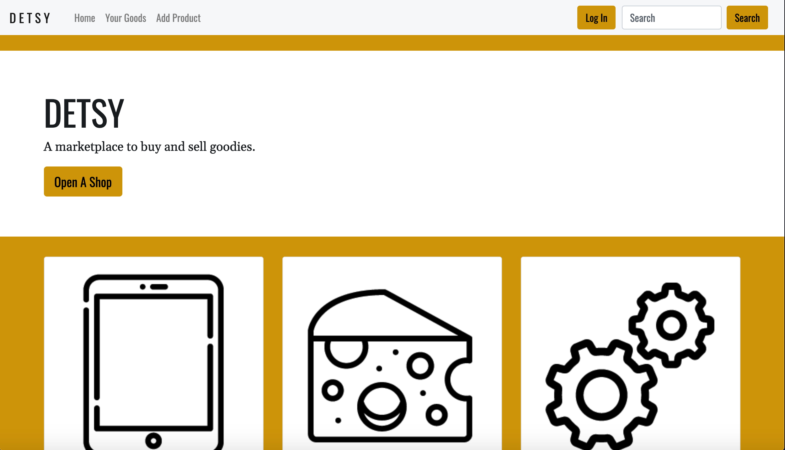
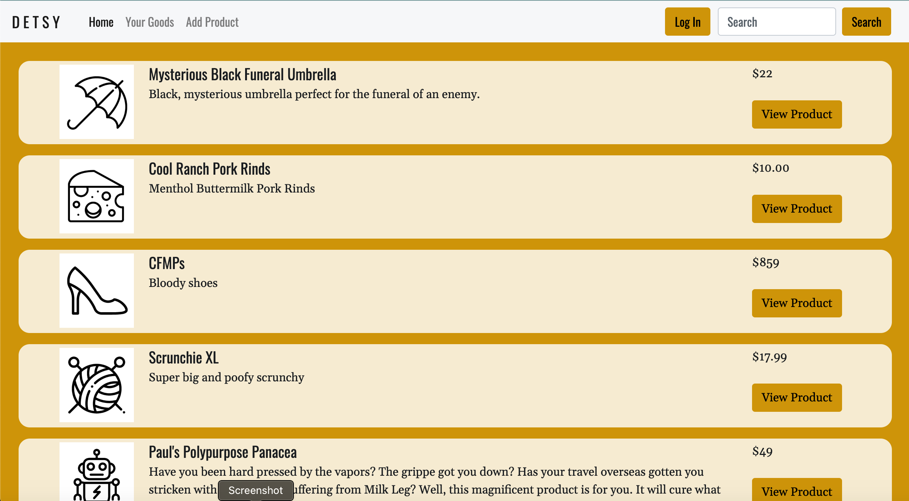
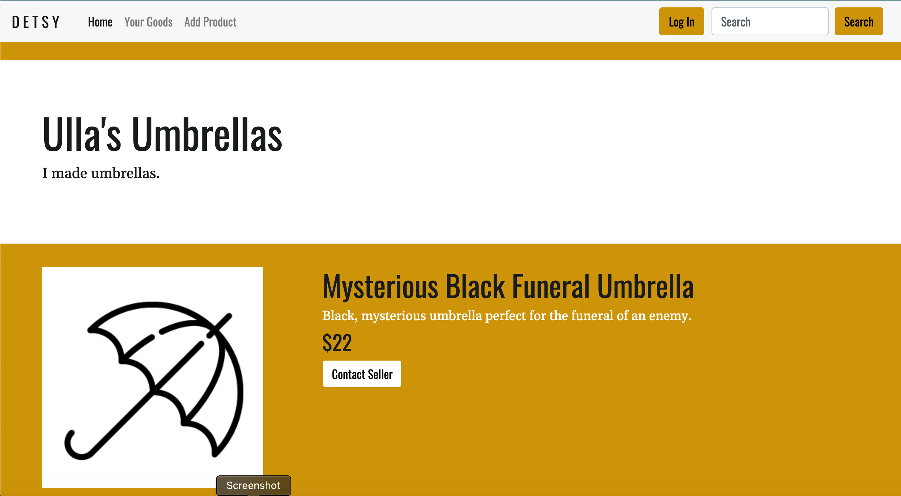
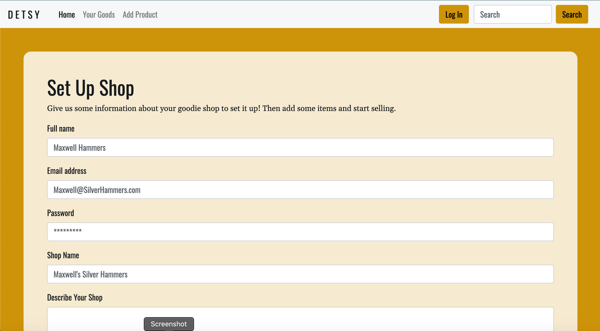

# Detsy

## Usage

This is a helpful app for both buyers to find unique, handcrafted items, or sellers to make their art available to people around the world.

## Description

This is a marketplace app. Using this app users can create a profile, list items to sell, shop for items, and communicate with other users on the site. All products listed by a given user will show up on their own personal page, or you can view other users pages. So if you find a seller you like, you can look for other things they sell. The site also contains a search function, for when you’re looking for that special something for a special someone.

## Live App

https://detsy.herokuapp.com/

## Images

## Contribution

Amira Chikhaoui,
Det Sorthepharack,
Mary Jacobs,
Paul Hendrickson, and
Samantha Sengsouvanh

Credit to Jake O’Toole for the format of this readme.

## Future Developments

• Have it function.
• Built in messaging app for security and privacy.
• General filters to prevent misuse of application.
• Secure payment platform.
• Filters to sort products by category/color/size/...etc.
• Ability to ‘like’ or ‘favorite’ shops and products.
• Add light customization ability to shop pages.
• Integrations with social media platforms.

## Challenges

One of our members, Paul, was out sick for most of the project. Him working remote added several more communication challenges, and his brain working at 50% (his words) didn't help either. Passport was hard to set up, and it was challenging to figure out how to connect the database, back to our front-end at the last minute.

## Credits

Triology Education Services created the prompt for this group assignment. Credit to Jake O’Toole for the format of this readme.

## License

This project is licensed under the MIT License - see the LICENSE.md file for details.
 
